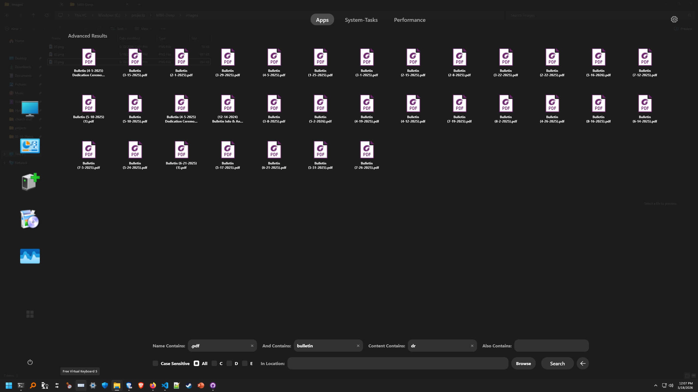
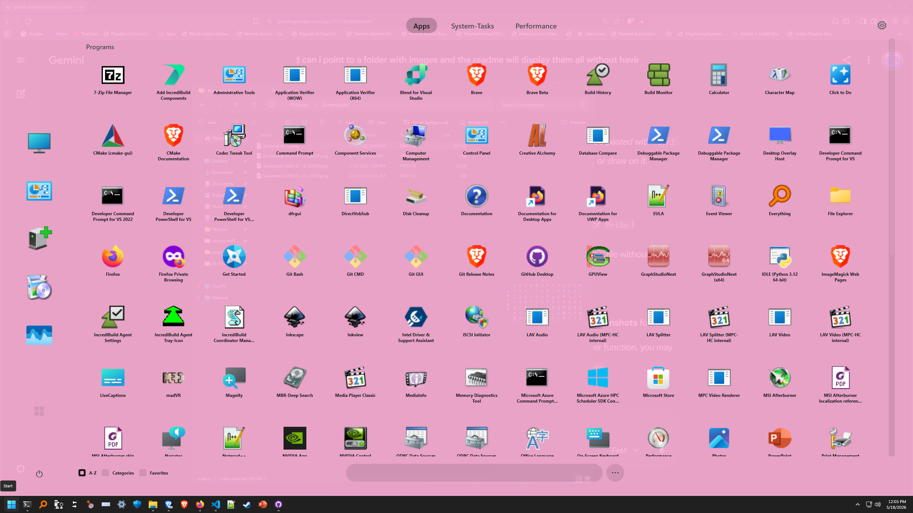
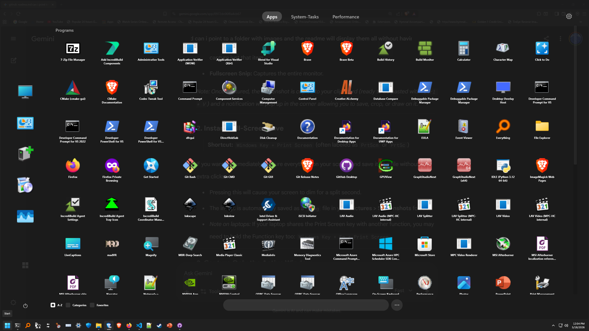
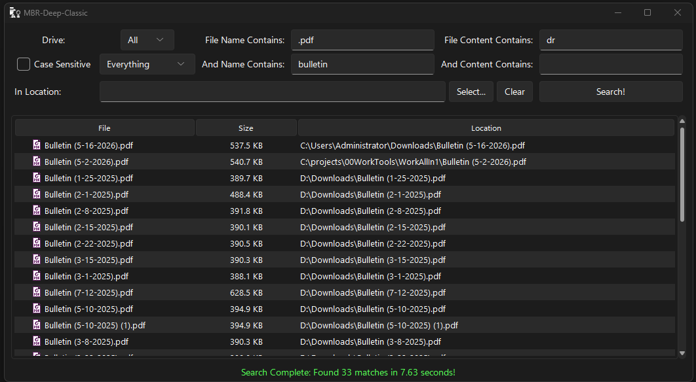

# MBR-Deep

MBR-Deep is a high-performance Windows file search utility that queries the NTFS Master File Table (MFT) directly. By bypassing the standard Windows API file iteration and using a custom C-engine DLL, it achieves lightning-fast file discovery across entire hard drives. 

**Recent major updates have transitioned MBR-Deep from a simple all-in-one application to a robust Client/Server architecture.** It now functions as a full Start Menu App Drawer replacement, featuring an always-on, secure Windows Service backend and a lightning-fast .NET WPF frontend. Extensive testing has been conducted to ensure high security, robustness, and stability under heavy loads.

*(Note: The original all-in-one Python/Tkinter application is still fully intact and available in the source code.)*

## 🪟 App Drawer vs. Classic UI

MBR-Deep offers two distinct ways to search your system:

- **The App Drawer (Modern):** A lightning-fast, C#/.NET 10 WPF overlay designed to replace your Start Menu. It runs securely as a standard user process and communicates instantly with a background Windows Service (`MBR-DeepService`) for zero-overhead, always-on file and app discovery via a global hotkey (e.g., `Alt+Space`).
- **MBR-Deep Classic (Legacy):** The original Python/Tkinter all-in-one standalone executable. It requires direct Administrator privileges to run but excels at deep, multi-threaded content grepping (PDFs, Archives) and acts as a traditional, portable desktop search utility without needing to install a background service.






## ✨ Features

- **Instant-Summon App Drawer:** Acts as a complete Start Menu overlay, accessible instantly via global hotkeys.
- **Client-Server Architecture:** A secure background service handles elevated MFT access, allowing the user-facing UI to run instantly without UAC prompts.
- **Ultra-Fast Discovery:** Reads directly from the Windows NTFS Master File Table (MFT) using a low-level C DLL.
- **Deep Content Search:** Grep through file contents rapidly using multi-threaded execution.
- **PDF & Archive Support:** Extracts and searches text within PDFs (via `pypdfium2`) and compressed archives.
- **Modern UI:** GNOME-style WPF grid and legacy Python dark-mode integration using `sv_ttk`.
- **Native System Icons:** Extracts and displays real Windows shell icons for files securely on the UI thread.
- **Live Results:** Streams matches to the UI in real-time as the search progresses.
- **Explorer Integration:** Right-click context menus to open files, show in Explorer, or use "Open With...".

## ⚠️ Prerequisites

- **Operating System:** Windows 10 / 11 (NTFS file system required).
- **.NET 10:** For the new WPF UI and Background Service.
- **Administrator Privileges:** Direct access to the volume's MFT *requires* the background service to be run as an Administrator (the Frontend UI runs as a standard user).
- **Python 3.x:** (Optional) To run the legacy GUI and scripts.
- **C/C++ Compiler:** To build the `fast_search.dll` (if not already compiled).

## 🚀 Getting Started

The project includes PowerShell automation scripts to make setup seamless.

### 1. New .NET 10 App Drawer & Background Service

- **Frontend UI:** Use `.\build_AppDrawer.ps1` to build and launch the modern WPF App Drawer (`MBR-DeepDrawer`).
- **Backend Service:** Run the `src\BackendService\MBR-DeepService.csproj` project as an Administrator, or install it as a persistent Windows Service.
- **Production Installer:** Run `.\publish.ps1` to compile the C-Engine, Backend Service, and Frontend UI, and bundle them into a single `MBRDeep_Setup.exe` installer.
- **Stress Testing:** Run `.\test_publish.ps1` or `.\test_gm_publish.ps1` to execute the rigorous IPC stress and stability test suites.

### 2. Legacy Python App (Development)

Open a PowerShell terminal **as Administrator** and execute the run script:

```powershell
.\run.ps1
```

**What this script does:**
1. Creates an isolated Python virtual environment (`.env`).
2. Automatically installs missing dependencies (`sv_ttk`, `pypdfium2`, `pywin32`, `pillow`).
3. Verifies that the C-engine DLL (`fast_search.dll`) exists.
4. Launches the GUI application (`main.py`).

### 3. Building a Standalone Executable (Production - Legacy)

To package the entire application (Python script, dependencies, and the C DLL) into a single, portable `.exe` file, run:

```powershell
.\publish.ps1
```

**What this script does:**
1. Installs `pyinstaller`.
2. Bundles the application, embedding the `fast_search.dll`, custom icons, and UI themes.
3. Outputs the compiled `.exe` into the `dist/` directory.

## 🛠️ Architecture

MBR-Deep uses a highly optimized Client-Server model for maximum performance and a responsive user experience:

1. **The Engine (C/C++):** `fast_search.dll` does the heavy lifting. It uses the Windows `FSCTL_ENUM_USN_DATA` control code to stream the entire file table incredibly fast.
2. **The Backend Service (.NET 10):** An elevated background worker that hosts the C-engine, safely handling MFT scans and fast archive/PDF grepping. It accepts requests via asynchronous Named Pipes.
3. **The Frontend UI (WPF / XAML):** A lightweight, native Windows App Drawer overlay that connects to the backend service. It streams search results dynamically without requiring UAC elevation.
4. **Legacy Mode (Python):** The `main.py` script offers an older monolithic approach using a `ThreadPoolExecutor` and `tkinter`.

## 🐛 Troubleshooting

- **"Cannot access drive" / Engine Offline**: Ensure the Backend Service is running as Administrator/LocalSystem. Windows blocks standard user-level processes from reading raw volume data.
- **Icons are missing**: Ensure the `pywin32` and `Pillow` libraries installed successfully. The `run.ps1` script should handle this automatically.
- **"fast_search.dll not found"**: You need to compile the C/C++ backend into a DLL before running the Python script. (Usually done via a `build.ps1` or a Makefile, depending on your C++ environment).

## 📄 License

This project utilizes several open-source libraries:
- `Pillow` (HPND License)
- `pywin32` (Python Software Foundation License)
- `sv_ttk` (MIT License)
